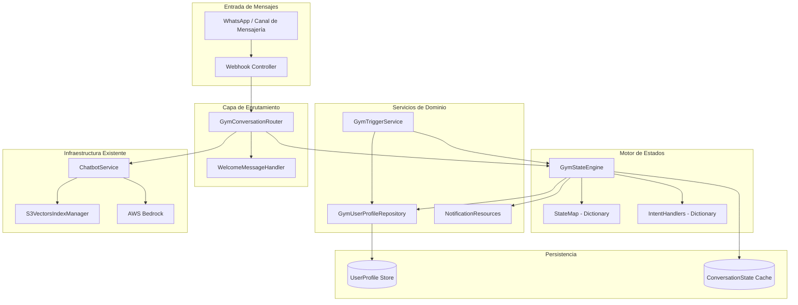
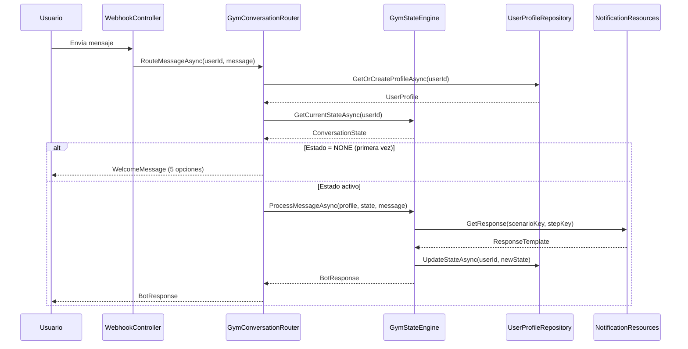
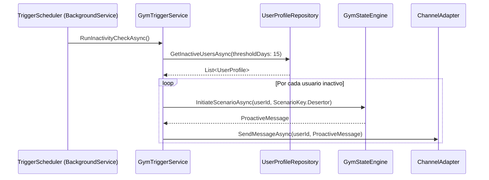

# Design Document: gym-chatbot-conversational-flows

## Overview

Este módulo implementa la capa de lógica de negocio para un chatbot conversacional de gimnasio sobre la infraestructura existente de C# .NET 8 / AWS Bedrock / S3 Vectors. El sistema gestiona 16 escenarios de retención, ventas y fidelización mediante una máquina de estados basada en intenciones (intents), un enrutador principal de bienvenida con 5 opciones, y un motor de triggers automáticos para eventos proactivos (inactividad, seguimiento post-clase, hitos de gamificación).

El diseño extiende `ChatbotService.cs` con nuevos servicios especializados sin romper la arquitectura existente: `GymConversationRouter`, `GymStateEngine`, `GymTriggerService` y `GymUserProfileRepository`, todos registrados en el contenedor DI de `Program.cs`.

---

## Architecture



---

## Sequence Diagrams

### Flujo Principal: Mensaje Entrante



### Flujo Trigger: Detección de Desertor



---

## Components and Interfaces

### GymConversationRouter

**Propósito**: Punto de entrada único para todos los mensajes. Decide si mostrar el menú de bienvenida o delegar al motor de estados.

**Interface**:
```csharp
public interface IGymConversationRouter
{
    Task<BotResponse> RouteMessageAsync(string userId, string incomingMessage);
}
```

**Responsabilidades**:
- Obtener o crear el perfil del usuario
- Detectar si el usuario está en estado inicial → mostrar WelcomeMessage
- Detectar selección de opción del menú (1-5) → inicializar escenario correspondiente
- Delegar mensajes en flujo activo al `GymStateEngine`

---

### GymStateEngine

**Propósito**: Máquina de estados basada en diccionario de intenciones. Elimina if/else anidados usando un `Dictionary<(ScenarioKey, StepKey), IIntentHandler>`.

**Interface**:
```csharp
public interface IGymStateEngine
{
    Task<BotResponse> ProcessMessageAsync(UserProfile profile, ConversationState state, string message);
    Task<ConversationState> GetCurrentStateAsync(string userId);
    Task InitiateScenarioAsync(string userId, ScenarioKey scenario);
    Task ResetStateAsync(string userId);
}
```

**Responsabilidades**:
- Resolver el handler correcto según `(ScenarioKey, StepKey)` actual
- Ejecutar el handler y obtener la respuesta + siguiente estado
- Persistir la transición de estado
- Manejar transiciones de embudo: TOFU → MOFU → BOFU → FIDELIZACIÓN

---

### GymUserProfileRepository

**Propósito**: CRUD del perfil de usuario con campos de negocio del gimnasio.

**Interface**:
```csharp
public interface IGymUserProfileRepository
{
    Task<UserProfile> GetOrCreateProfileAsync(string userId);
    Task UpdateProfileAsync(UserProfile profile);
    Task<IEnumerable<UserProfile>> GetInactiveUsersAsync(int thresholdDays);
    Task<IEnumerable<UserProfile>> GetUsersWithMilestoneAsync(MilestoneType milestone);
    Task UpdateConversationStateAsync(string userId, ConversationState state);
    Task<ConversationState?> GetConversationStateAsync(string userId);
}
```

---

### GymTriggerService

**Propósito**: Motor de eventos proactivos. Se ejecuta como `BackgroundService` de .NET con intervalos configurables.

**Interface**:
```csharp
public interface IGymTriggerService
{
    Task RunInactivityCheckAsync();
    Task RunPostFirstClassFollowUpAsync();
    Task RunMilestoneCheckAsync();
    Task RunAbandonedFormCheckAsync();
    Task RunMonthlyProgressReportAsync();
}
```

---

### NotificationResources

**Propósito**: Centraliza todos los textos de respuesta. Ningún string de respuesta al usuario vive en la lógica de negocio.

**Interface**:
```csharp
public interface INotificationResources
{
    string GetWelcomeMessage();
    string GetResponse(ScenarioKey scenario, StepKey step, Dictionary<string, string>? variables = null);
    string GetProactiveMessage(TriggerType trigger, Dictionary<string, string>? variables = null);
}
```

---

## Data Models

### UserProfile

```csharp
public class UserProfile
{
    public string UserId              { get; set; } = string.Empty;
    public string Name                { get; set; } = string.Empty;
    public string PhoneNumber         { get; set; } = string.Empty;
    public MembershipType TipoMembresia { get; set; } = MembershipType.None;
    public FitnessGoal Objetivo       { get; set; } = FitnessGoal.NotDefined;
    public DateTime? FechaUltimoCheckIn { get; set; }
    public DateTime? FechaPrimeraClase  { get; set; }
    public DateTime CreatedAt         { get; set; } = DateTime.UtcNow;
    public List<string> LesionesPrevias { get; set; } = new();
    public int TotalClasesAsistidas   { get; set; }
    public FunnelStage EtapaEmbudo    { get; set; } = FunnelStage.TOFU;
    public ConversationState? CurrentState { get; set; }
    public Dictionary<string, object> Metadata { get; set; } = new();
}
```

**Reglas de validación**:
- `UserId` no puede ser vacío
- `FechaUltimoCheckIn` no puede ser futura
- `TotalClasesAsistidas` >= 0

---

### ConversationState

```csharp
public class ConversationState
{
    public string UserId              { get; set; } = string.Empty;
    public ScenarioKey ActiveScenario { get; set; } = ScenarioKey.None;
    public StepKey CurrentStep        { get; set; } = StepKey.Initial;
    public FunnelStage FunnelStage    { get; set; } = FunnelStage.TOFU;
    public DateTime LastInteraction   { get; set; } = DateTime.UtcNow;
    public Dictionary<string, string> ContextData { get; set; } = new();
    public bool IsActive              { get; set; } = true;
}
```

---

### Enumeraciones de Dominio

```csharp
public enum ScenarioKey
{
    None = 0,
    PropositoAnoNuevo = 1,
    AtletaEstancado = 2,
    Desertor = 3,
    ConsultaPrecios = 4,
    MiedoPesas = 5,
    HorariosMulticlub = 6,
    UrgenciaClases = 7,
    VentaGrupal = 8,
    RecuperacionAbandono = 9,
    CongelacionMembresia = 10,
    CrossSellingNutricion = 11,
    FelicitacionHito = 12,
    EncuestaClase = 13,
    ProgramaReferidos = 14,
    ReporteResultados = 15,
    GestionQuejas = 16
}

public enum StepKey
{
    Initial,
    TOFU_Question,
    TOFU_Response,
    MOFU_Offer,
    MOFU_Response,
    BOFU_Confirm,
    BOFU_Payment,
    Fidelizacion_Day1,
    Fidelizacion_Week2,
    Completed
}

public enum FunnelStage  { TOFU, MOFU, BOFU, Fidelizacion }
public enum MembershipType { None, Basic, Premium, Multiclub, Frozen }
public enum FitnessGoal  { NotDefined, WeightLoss, MuscleGain, Endurance, Flexibility, General }
public enum MilestoneType { Class10, Class50, Class100, Month1, Month6 }
public enum TriggerType  { Inactivity15Days, PostFirstClass24h, AbandonedForm2h, Milestone, MonthlyReport }
```

---

## Algorithmic Pseudocode

### Algoritmo Principal: RouteMessageAsync

```pascal
ALGORITHM RouteMessageAsync(userId, incomingMessage)
INPUT: userId: String, incomingMessage: String
OUTPUT: BotResponse

PRECONDITIONS:
  - userId IS NOT NULL AND NOT EMPTY
  - incomingMessage IS NOT NULL

POSTCONDITIONS:
  - Returns a non-null BotResponse
  - ConversationState is persisted after each call
  - FunnelStage is updated if transition occurred

BEGIN
  profile ← await userProfileRepository.GetOrCreateProfileAsync(userId)
  state   ← await stateEngine.GetCurrentStateAsync(userId)

  IF state.ActiveScenario = ScenarioKey.None THEN
    // Primera interacción o reset: mostrar menú
    RETURN BotResponse(notificationResources.GetWelcomeMessage())
  END IF

  IF IsMenuSelection(incomingMessage) THEN
    selectedOption ← ParseMenuOption(incomingMessage)
    scenario       ← menuOptionToScenarioMap[selectedOption]
    await stateEngine.InitiateScenarioAsync(userId, scenario)
    state ← await stateEngine.GetCurrentStateAsync(userId)
  END IF

  response ← await stateEngine.ProcessMessageAsync(profile, state, incomingMessage)

  RETURN response
END
```

**Loop Invariants**: N/A (no loops en este algoritmo)

---

### Algoritmo: ProcessMessageAsync (State Engine)

```pascal
ALGORITHM ProcessMessageAsync(profile, state, message)
INPUT: profile: UserProfile, state: ConversationState, message: String
OUTPUT: BotResponse

PRECONDITIONS:
  - state.ActiveScenario != ScenarioKey.None
  - state.CurrentStep IS VALID for ActiveScenario
  - intentHandlers[(state.ActiveScenario, state.CurrentStep)] EXISTS

POSTCONDITIONS:
  - state.CurrentStep advances to next valid step
  - state.FunnelStage advances if TOFU→MOFU→BOFU→Fidelizacion transition occurs
  - profile.EtapaEmbudo is synchronized with state.FunnelStage
  - BotResponse contains non-empty message text

BEGIN
  handlerKey ← (state.ActiveScenario, state.CurrentStep)

  IF NOT intentHandlers.ContainsKey(handlerKey) THEN
    RETURN BotResponse(notificationResources.GetResponse(ScenarioKey.None, StepKey.Initial))
  END IF

  handler  ← intentHandlers[handlerKey]
  result   ← await handler.HandleAsync(profile, state, message)

  // Actualizar estado
  state.CurrentStep  ← result.NextStep
  state.FunnelStage  ← result.NextFunnelStage
  state.LastInteraction ← DateTime.UtcNow

  // Sincronizar embudo en perfil
  IF result.NextFunnelStage > profile.EtapaEmbudo THEN
    profile.EtapaEmbudo ← result.NextFunnelStage
    await userProfileRepository.UpdateProfileAsync(profile)
  END IF

  await userProfileRepository.UpdateConversationStateAsync(profile.UserId, state)

  RETURN result.Response
END
```

**Loop Invariants**: N/A

---

### Algoritmo: RunInactivityCheckAsync (Trigger)

```pascal
ALGORITHM RunInactivityCheckAsync()
INPUT: (none - reads from repository)
OUTPUT: (side effect - sends proactive messages)

PRECONDITIONS:
  - Repository is accessible
  - Channel adapter is configured

POSTCONDITIONS:
  - All users with FechaUltimoCheckIn > 15 days receive proactive message
  - Their ConversationState is set to Desertor/TOFU_Question
  - No duplicate messages sent within 24h window

BEGIN
  inactiveUsers ← await userProfileRepository.GetInactiveUsersAsync(thresholdDays: 15)

  FOR EACH user IN inactiveUsers DO
    // Loop invariant: all previously processed users have received message
    // and their state has been updated

    lastTrigger ← user.Metadata.GetValueOrDefault("LastInactivityTrigger")

    IF lastTrigger IS NULL OR (DateTime.UtcNow - lastTrigger) > 24h THEN
      await stateEngine.InitiateScenarioAsync(user.UserId, ScenarioKey.Desertor)
      message ← notificationResources.GetProactiveMessage(
                   TriggerType.Inactivity15Days,
                   variables: { "name": user.Name })

      await channelAdapter.SendMessageAsync(user.UserId, message)

      user.Metadata["LastInactivityTrigger"] ← DateTime.UtcNow
      await userProfileRepository.UpdateProfileAsync(user)
    END IF
  END FOR
END
```

**Loop Invariants**:
- Todos los usuarios procesados anteriormente en la iteración tienen su estado actualizado
- No se envían mensajes duplicados dentro de la ventana de 24h

---

## Key Functions with Formal Specifications

### GymConversationRouter.RouteMessageAsync

```csharp
Task<BotResponse> RouteMessageAsync(string userId, string incomingMessage)
```

**Preconditions**:
- `userId` is non-null and non-empty
- `incomingMessage` is non-null (may be empty string)

**Postconditions**:
- Returns `BotResponse` with non-null `Message` property
- If `incomingMessage` is "1"-"5", `ConversationState.ActiveScenario` is set to corresponding `ScenarioKey`
- `ConversationState.LastInteraction` is updated to `DateTime.UtcNow`

---

### GymStateEngine.InitiateScenarioAsync

```csharp
Task InitiateScenarioAsync(string userId, ScenarioKey scenario)
```

**Preconditions**:
- `userId` is non-null and non-empty
- `scenario != ScenarioKey.None`

**Postconditions**:
- `ConversationState.ActiveScenario == scenario`
- `ConversationState.CurrentStep == StepKey.TOFU_Question`
- `ConversationState.FunnelStage == FunnelStage.TOFU`
- Previous `ContextData` is cleared

---

### GymTriggerService.RunInactivityCheckAsync

```csharp
Task RunInactivityCheckAsync()
```

**Preconditions**:
- `IGymUserProfileRepository` is available
- `IChannelAdapter` is configured with valid credentials

**Postconditions**:
- For each user where `(DateTime.UtcNow - FechaUltimoCheckIn).TotalDays > 15` AND no trigger sent in last 24h:
  - `ConversationState.ActiveScenario == ScenarioKey.Desertor`
  - Proactive message delivered via channel adapter
  - `Metadata["LastInactivityTrigger"]` updated

---

### NotificationResources.GetResponse

```csharp
string GetResponse(ScenarioKey scenario, StepKey step, Dictionary<string, string>? variables = null)
```

**Preconditions**:
- `scenario` and `step` form a valid combination registered in the resource dictionary

**Postconditions**:
- Returns non-null, non-empty string
- If `variables` provided, all `{key}` placeholders in template are replaced
- Falls back to a default "unknown" message if key not found (never throws)

---

## Example Usage

### Registro en Program.cs

```csharp
// Agregar en Program.cs después de los servicios existentes
builder.Services.AddSingleton<INotificationResources, NotificationResources>();
builder.Services.AddSingleton<IGymUserProfileRepository, GymUserProfileRepository>();
builder.Services.AddScoped<IGymStateEngine, GymStateEngine>();
builder.Services.AddScoped<IGymConversationRouter, GymConversationRouter>();
builder.Services.AddHostedService<GymTriggerBackgroundService>();
```

### Flujo Caso 1: Propósito de Año Nuevo

```csharp
// Mensaje 1: Usuario envía "1" (Clase de prueba gratis)
var response1 = await router.RouteMessageAsync("user-123", "1");
// response1.Message → "¡Hola! ¿Has entrenado antes o empezarías desde cero?"
// state.ActiveScenario = PropositoAnoNuevo, step = TOFU_Question

// Mensaje 2: Usuario responde "desde cero"
var response2 = await router.RouteMessageAsync("user-123", "desde cero");
// response2.Message → "¡Perfecto! Tenemos el Plan Welcome + clase de prueba gratis..."
// state.CurrentStep = MOFU_Offer, FunnelStage = MOFU

// Mensaje 3: Usuario confirma horario
var response3 = await router.RouteMessageAsync("user-123", "quiero el martes a las 7pm");
// response3.Message → "¡Listo! Tu clase está confirmada con el coach. Además tienes 20% de descuento..."
// state.CurrentStep = BOFU_Confirm, FunnelStage = BOFU
```

### Flujo Trigger: Desertor

```csharp
// Ejecutado por BackgroundService cada hora
await triggerService.RunInactivityCheckAsync();
// Internamente: detecta user con FechaUltimoCheckIn = hace 16 días
// Envía: "¡Hola [Nombre]! Te hemos extrañado. ¿Todo bien? 💪"
// Inicia escenario Desertor en TOFU_Question
```

### Consulta de estado actual

```csharp
var state = await stateEngine.GetCurrentStateAsync("user-123");
Console.WriteLine($"Escenario: {state.ActiveScenario}");  // Desertor
Console.WriteLine($"Etapa: {state.FunnelStage}");          // TOFU
Console.WriteLine($"Paso: {state.CurrentStep}");           // TOFU_Question
```

---

## Error Handling

### Escenario: Handler no encontrado para (ScenarioKey, StepKey)

**Condición**: La combinación de escenario+paso no tiene handler registrado  
**Respuesta**: Retornar mensaje de fallback desde `NotificationResources` (clave `ScenarioKey.None, StepKey.Initial`)  
**Recuperación**: Resetear estado a `ScenarioKey.None` para mostrar menú en siguiente mensaje

### Escenario: Fallo de persistencia de estado

**Condición**: `UpdateConversationStateAsync` lanza excepción  
**Respuesta**: Loggear error, retornar respuesta al usuario de todas formas (no bloquear UX)  
**Recuperación**: Reintentar en siguiente interacción; el estado se reconstruye desde el perfil

### Escenario: Canal de mensajería no disponible (Trigger)

**Condición**: `channelAdapter.SendMessageAsync` falla  
**Respuesta**: Loggear con nivel Warning, no marcar `LastInactivityTrigger` para reintentar  
**Recuperación**: El BackgroundService reintentará en el siguiente ciclo

### Escenario: Usuario sin perfil en base de datos

**Condición**: `GetOrCreateProfileAsync` no encuentra registro  
**Respuesta**: Crear perfil nuevo con valores por defecto, iniciar flujo de bienvenida  
**Recuperación**: Automática — el perfil se persiste en la misma llamada

---

## Testing Strategy

### Unit Testing

Cada `IIntentHandler` se prueba de forma aislada con mocks de `IGymUserProfileRepository` e `INotificationResources`. Casos clave:
- Handler retorna el `NextStep` correcto según input del usuario
- Handler avanza `FunnelStage` correctamente (TOFU→MOFU→BOFU→Fidelizacion)
- Handler no muta el perfil si no hay transición de embudo

### Property-Based Testing

**Librería**: `FsCheck` (compatible con .NET / xUnit)

Propiedades a verificar:
- Para cualquier `(ScenarioKey, StepKey)` válido, `ProcessMessageAsync` siempre retorna un `BotResponse` no nulo
- `FunnelStage` nunca retrocede (BOFU no puede volver a TOFU)
- `GetResponse` nunca lanza excepción para ninguna combinación de `ScenarioKey` y `StepKey` registrada
- `RunInactivityCheckAsync` nunca envía dos mensajes al mismo usuario dentro de 24h

### Integration Testing

- Flujo completo de los 3 escenarios principales (Caso 1, 2, 3) de TOFU a Fidelización
- Trigger de inactividad: verificar que solo usuarios con > 15 días inactivos reciben mensaje
- Reset de estado: verificar que después de `ResetStateAsync` el usuario vuelve al menú de bienvenida

---

## Performance Considerations

- `ConversationState` se cachea en memoria (IMemoryCache) con TTL de 30 minutos para evitar lecturas repetidas a la base de datos en conversaciones activas
- `NotificationResources` carga todos los templates al inicio (singleton) — O(1) para cada `GetResponse`
- El `BackgroundService` de triggers usa `PeriodicTimer` de .NET 8 para evitar drift de intervalos
- `GetInactiveUsersAsync` debe usar paginación si el volumen de usuarios supera 10,000

## Security Considerations

- `UserId` proviene del canal de mensajería (WhatsApp Business API) — validar formato antes de persistir
- Los textos de respuesta en `NotificationResources` no deben contener datos personales hardcoded
- Las variables de interpolación en templates deben sanitizarse para evitar injection en canales que renderizan HTML
- El `BackgroundService` no debe exponer endpoints HTTP — solo opera internamente

## Dependencies

| Dependencia | Uso | Ya presente |
|---|---|---|
| `Microsoft.Extensions.Hosting` | BackgroundService para triggers | ✅ |
| `Microsoft.Extensions.Caching.Memory` | Cache de ConversationState | ➕ Agregar |
| `FsCheck.Xunit` | Property-based testing | ➕ Agregar (solo test project) |
| `Microsoft.EntityFrameworkCore` | Persistencia de UserProfile | ➕ Agregar (o usar DynamoDB) |
| `AWS SDK (existente)` | Canal de mensajería / Bedrock | ✅ |

---

## Correctness Properties

*A property is a characteristic or behavior that should hold true across all valid executions of a system — essentially, a formal statement about what the system should do. Properties serve as the bridge between human-readable specifications and machine-verifiable correctness guarantees.*

### Property 1: RouteMessageAsync siempre retorna respuesta no nula

*For any* `userId` and `incomingMessage` (including empty strings and arbitrary content), `GymConversationRouter.RouteMessageAsync` should return a non-null `BotResponse` with a non-empty `Message` property.

**Validates: Requirements 1.4, 11.3**

---

### Property 2: Estado None produce WelcomeMessage

*For any* user whose `ConversationState.ActiveScenario` is `ScenarioKey.None`, sending any message should return the `WelcomeMessage` and should NOT modify `ConversationState.ActiveScenario`.

**Validates: Requirements 1.1, 9.1, 9.3**

---

### Property 3: Selección de menú inicializa escenario correcto

*For any* menu option in the range "1"–"5" sent by a user in `ScenarioKey.None` state, the resulting `ConversationState.ActiveScenario` should be the scenario mapped to that option, `CurrentStep` should be `StepKey.TOFU_Question`, and `FunnelStage` should be `FunnelStage.TOFU`.

**Validates: Requirements 1.2, 3.1**

---

### Property 4: InitiateScenarioAsync limpia ContextData

*For any* `userId` with any prior `ContextData` in their `ConversationState`, calling `GymStateEngine.InitiateScenarioAsync` with any valid `ScenarioKey` should result in an empty `ContextData` dictionary.

**Validates: Requirements 3.2**

---

### Property 5: FunnelStage es monótonamente no decreciente

*For any* sequence of calls to `GymStateEngine.ProcessMessageAsync`, the `FunnelStage` value in `ConversationState` should never decrease — a state at `BOFU` cannot transition to `MOFU` or `TOFU`, and a state at `Fidelizacion` cannot transition to any earlier stage.

**Validates: Requirements 3.5**

---

### Property 6: EtapaEmbudo del perfil se sincroniza con FunnelStage

*For any* `IIntentHandler` result that advances `FunnelStage`, the `UserProfile.EtapaEmbudo` should equal `ConversationState.FunnelStage` after `ProcessMessageAsync` completes.

**Validates: Requirements 3.4**

---

### Property 7: Reset restaura estado inicial

*For any* user in any active scenario, calling `GymStateEngine.ResetStateAsync` followed by any message should return the `WelcomeMessage`, confirming `ConversationState.ActiveScenario` is `ScenarioKey.None`.

**Validates: Requirements 3.7**

---

### Property 8: ProcessMessageAsync persiste el estado actualizado

*For any* call to `GymStateEngine.ProcessMessageAsync` that completes without exception, a subsequent call to `GymUserProfileRepository.GetConversationStateAsync` for the same `userId` should return a `ConversationState` reflecting the updated `CurrentStep` and `FunnelStage`.

**Validates: Requirements 3.8**

---

### Property 9: GetResponse nunca lanza excepción para claves registradas

*For any* `(ScenarioKey, StepKey)` combination that is registered in `NotificationResources`, calling `GetResponse` should return a non-null, non-empty string and should never throw an exception.

**Validates: Requirements 4.2**

---

### Property 10: Interpolación de variables reemplaza todos los placeholders

*For any* template string containing `{key}` placeholders and any `variables` dictionary where all keys are present, calling `NotificationResources.GetResponse` or `GetProactiveMessage` should return a string where no `{key}` placeholder from the dictionary remains unreplaced.

**Validates: Requirements 4.4, 4.5**

---

### Property 11: GetInactiveUsersAsync filtra correctamente por umbral

*For any* set of `UserProfile` records with varying `FechaUltimoCheckIn` values and any `thresholdDays` value, `GymUserProfileRepository.GetInactiveUsersAsync(thresholdDays)` should return only users where `(DateTime.UtcNow - FechaUltimoCheckIn).TotalDays > thresholdDays`.

**Validates: Requirements 2.3, 5.1**

---

### Property 12: Sin mensajes duplicados de inactividad en 24h

*For any* user with `Metadata["LastInactivityTrigger"]` set to a time within the last 24 hours, calling `GymTriggerService.RunInactivityCheckAsync` should NOT send a message to that user nor update their `LastInactivityTrigger`.

**Validates: Requirements 5.5**

---

### Property 13: Fallo del canal no interrumpe el batch de triggers

*For any* batch of inactive users where the channel adapter fails for one or more users, `GymTriggerService.RunInactivityCheckAsync` should still attempt to process all remaining users in the batch.

**Validates: Requirements 5.2, 11.2**

---

### Property 14: Fallo de persistencia no bloquea la respuesta al usuario

*For any* call to `GymStateEngine.ProcessMessageAsync` where `GymUserProfileRepository.UpdateConversationStateAsync` throws an exception, the method should still return a non-null `BotResponse` to the caller without re-throwing the exception.

**Validates: Requirements 11.1**

---

### Property 15: TotalClasesAsistidas es siempre no negativo

*For any* `UserProfile` stored or retrieved via `GymUserProfileRepository`, the `TotalClasesAsistidas` field should always be greater than or equal to zero.

**Validates: Requirements 2.6**

---

### Property 16: Caché devuelve estado consistente tras actualización

*For any* `userId`, after calling `GymUserProfileRepository.UpdateConversationStateAsync` with a new `ConversationState`, a subsequent call to `GymStateEngine.GetCurrentStateAsync` for the same `userId` should return a state consistent with the update (not a stale cached value).

**Validates: Requirements 10.2**
